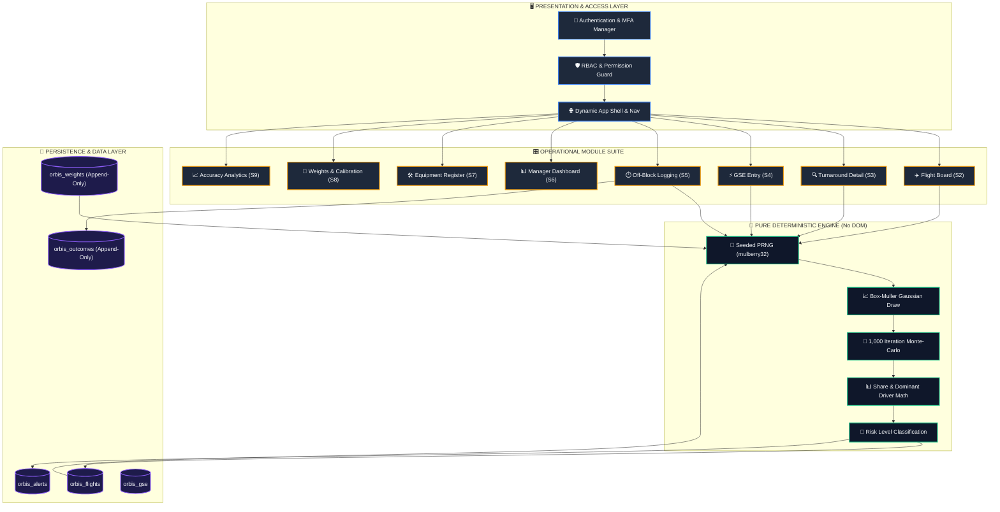
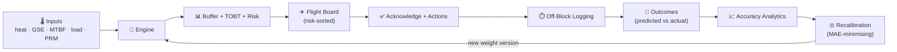
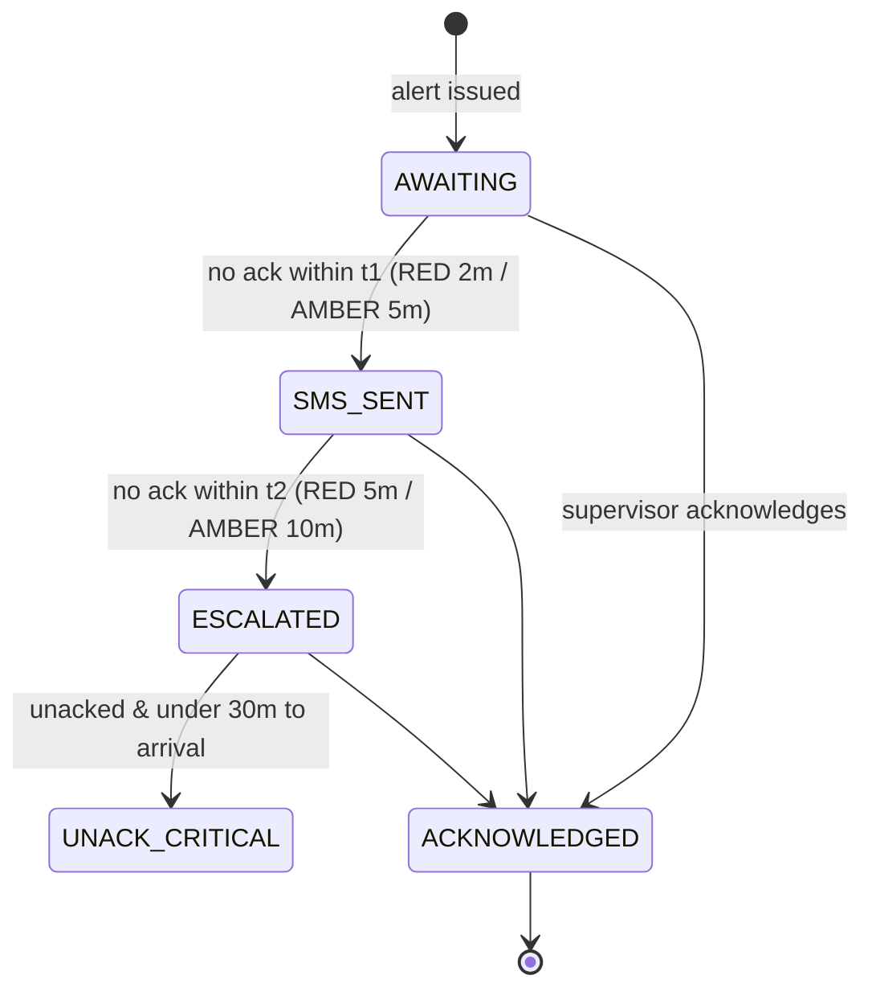

<div align="center">

# ✈️ ORBIS

### On-Time Ramp Buffer Intelligence System

**A decision-support platform that predicts aircraft turnaround buffer times using deterministic Monte-Carlo simulation — turning ramp uncertainty into a number a supervisor can act on.**

<br/>

<!-- ── live repo badges (auto-update from GitHub) ── -->
[](https://github.com/LeGeND212L/Airport-ORBIS-Prototype/commits/main)
[](https://github.com/LeGeND212L/Airport-ORBIS-Prototype)
[](https://github.com/LeGeND212L/Airport-ORBIS-Prototype)
[](https://github.com/LeGeND212L/Airport-ORBIS-Prototype/stargazers)

<!-- ── static tech badges ── -->


<br/>

[**Live Engine Highlights**](#-the-simulation-engine) · [**Modules**](#-modules-at-a-glance) · [**Architecture**](#-architecture) · [**Quick Start**](#-quick-start) · [**Demo Access**](#-demo-access)

</div>

---

## 📖 Overview

On the apron, a delayed pushback cascades into missed slots, crew-hour breaches and knock-on delays across the network. Supervisors decide **how much buffer** to add to a turnaround under heat, equipment shortages and passenger load — usually by gut feel.

**ORBIS replaces the guess with a defensible number.** For every flight it runs a **1,000-iteration Monte-Carlo simulation** over five operational risk variables and returns a recommended buffer, a full confidence band (P10 / P50 / P90), a risk classification (`GREEN` / `AMBER` / `RED`), the **dominant driver**, and a Target Off-Block Time (TOBT) — each one **reproducible to the exact digit**, because a disputed prediction must be *investigable*, not re-rolled.

> Built as a single, dependency-free front-end: **3 files, ~5,300 lines, zero libraries.** Every chart, gauge and distribution is hand-drawn SVG/canvas.

---

## 📑 Table of Contents

- [Key Features](#-key-features)
- [Modules at a Glance](#-modules-at-a-glance)
- [The Simulation Engine](#-the-simulation-engine)
- [Architecture](#-architecture)
- [Data & Learning Loop](#-data--learning-loop)
- [Alert Escalation Model](#-alert-escalation-model)
- [Tech Stack](#-tech-stack)
- [Quick Start](#-quick-start)
- [Demo Access](#-demo-access)
- [Project Structure](#-project-structure)
- [Storage Model](#-storage-model)
- [Engineering Highlights](#-engineering-highlights)
- [Roadmap](#-roadmap)
- [Author](#-author)

---

## ✨ Key Features

- 🔐 **Full auth stack** — login, request-access sign-up, corporate-email gate, password-strength enforcement, **5-digit MFA**, and 15-minute sliding session management.
- 🛡️ **Role-based access control** — six roles, per-user module permissions enforced **in the data layer**, not just hidden in the UI.
- 🧮 **Deterministic simulation engine** — seeded PRNG (mulberry32) + Box–Muller Gaussian sampling; *never* touches the DOM, *never* calls `Math.random()`.
- 📊 **Eight operational modules** — from a glare-readable ramp Flight Board to a super-admin calibration console.
- 🔔 **Live alert engine** — SMS → escalation → critical cascade with acknowledgement countdowns.
- 🌦️ **Degraded mode** — when the weather/DCS feed drops, flights fall back to cached inputs, get flagged, and *still* produce a prediction.
- 📈 **Closed learning loop** — logged outcomes feed accuracy analytics and an MAE-minimising recalibration proposal.
- 🧾 **Append-only audit & versioning** — every consequential action is logged; weight versions are never overwritten.
- 🎨 **Production-grade polish** — count-up numbers, staggered entrances, skeleton shimmer, custom modals/toasts, full `prefers-reduced-motion` support.

---

## 🧭 Modules at a Glance

| # | Module | Key | What it does |
|---|--------|-----|--------------|
| S2 | **Flight Board** | `flightboard` | Risk-sorted turnaround cards (RED→AMBER→GREEN), glare-safe, live acknowledgement countdowns |
| S3 | **Turnaround Detail** | `turnaround` | Buffer gauge, P10–P90 confidence band, 1,000-outcome histogram, driver breakdown, provenance & **reproducibility verifier** |
| S4 | **GSE Entry** | `gse` | Shift-start ground-equipment availability with a live recalculation sequence across all pending flights |
| S5 | **Off-Block Logging** | `offblock` | Captures actuals, computes signed prediction error, enforces delay-reason codes — closes the learning loop |
| S6 | **Manager Dashboard** | `manager` | KPI strip, escalation panel, risk donut, buffer timeline, integration health — with **airline-rep read-only scoping** |
| S7 | **Equipment Register** | `equipment` | GSE fleet management, maintenance logs, failure-probability, status-driven recalcs |
| S8 | **Weights & Thresholds** | `weights` | Calibration console: live preview, **monotonicity self-check (T9)**, append-only version history + diff |
| S9 | **Accuracy Analytics** | `analytics` | Predicted-vs-actual scatter, error distribution, per-supervisor accuracy (anonymised by default), recalibration proposal, CSV/JSON export |

---

## 🔬 The Simulation Engine

The engine is the heart of ORBIS — a **pure, isolated, arrays-in / numbers-out** module. That isolation is a requirement, not a preference: it is what makes every prediction auditable.

### 1 · Normalise five raw inputs to `[0,1]`

$$
v_1=\frac{T_{heat}-28}{55-28},\quad
v_2=1-\frac{gse_{avail}}{gse_{total}},\quad
v_3=p_{mtbf},\quad
v_4=\frac{load\%}{100},\quad
v_5=\frac{prm}{prm_{p95}}
$$

### 2 · Monte-Carlo — 1,000 deterministic iterations

A **mulberry32** PRNG is seeded from `hash(flightNumber + calculationTimestamp)`, then drives **Box–Muller** Gaussian draws. Same inputs → same seed → **bit-identical output on every reload.**

$$
s_{i,k}\sim \mathcal{N}(v_k,\ \sigma_k),\qquad
C_i=\sum_{k=1}^{5} s_{i,k}\cdot w_k
$$

$$
p_i=\frac{1}{1+e^{-10\,(C_i-0.5)}},\qquad
B_i = B_{base} + p_i \cdot B_{max}
$$

The engine returns **P10 / P50 / P90 / mean / std** over the 1,000 buffer samples, plus the seed and compute time.

### 3 · Attribution, classification & TOBT

$$
\text{share}_k=\frac{v_k w_k}{\sum_j v_j w_j},\qquad
\text{dominant}=\arg\max_k(\text{share}_k)
$$

| Condition | Risk |
|-----------|------|
| `P90 ≤ 30` **and** `spread < 6` | 🟢 **GREEN** |
| `P90 ≤ 40` **and** `spread < 12` | 🟡 **AMBER** |
| otherwise | 🔴 **RED** |

$$
\text{TOBT} = \text{EIBT} + \text{round}(P_{50})
$$

> **Guaranteed monotonic.** The built-in **T9 self-check** sweeps a sampled input grid and asserts the buffer *never decreases* as any single variable rises — verified across **480 combinations with zero violations**. A hotter day can never produce a *shorter* buffer.

---

## 🏗️ Architecture

ORBIS is engineered with a strict **decoupled, multi-tier architecture** separating the user presentation layer, permission guards, state management, and the pure deterministic calculation engine.

### 🏛️ System Layer Overview



### 🧩 Architectural Layer Breakdown

| Layer | Responsibility | Key Components & Guarantees |
| :--- | :--- | :--- |
| **1. App Shell & Security** | Authentication, MFA & Access Control | • **Role-Based Access Control (RBAC):** Restricts modules at the data-array level.<br/>• **Session Management:** 15-min sliding activity expiry & 5-digit corporate MFA. |
| **2. Operations Suite** | Interactive User Workspaces (S2–S9) | • **8 Operational Modules:** Flight board, turnaround details, GSE entry, off-block logs, manager KPIs, equipment register, weights calibration, and analytics.<br/>• **UI Stability:** Focus-preserving virtualized DOM row updates. |
| **3. Pure Simulation Engine** | Deterministic Monte-Carlo Simulation | • **Zero DOM Dependence:** Arrays-in / numbers-out pure function.<br/>• **Seeded PRNG (`mulberry32` + `Box-Muller`):** 1,000 iterations producing 100% reproducible predictions.<br/>• **Monotonicity Contract (T9):** Guarantees higher risk inputs never decrease recommended buffers. |
| **4. Persistence & Audit** | Namespaced Local Storage State | • **Append-Only Repositories:** Weight versions & historical outcomes are preserved permanently.<br/>• **Audit Log:** Complete activity & alert escalation trail. |

### ⚡ Data Flow Sequence

1. **Input Ingestion & Provenance Tagging:** Live weather, GSE availability, MTBF failure probability, passenger load, and PRM counts arrive with quality metadata (`GOOD`, `STALE`, `MANUAL`, `CACHED`).
2. **Deterministic Seed Generation:** `hash(flightNumber + timestamp)` creates a unique seed.
3. **1,000 Monte-Carlo Draws:** Normalised inputs undergo Gaussian sampling and non-linear logistic scaling.
4. **Buffer & TOBT Computation:** Engine outputs P10/P50/P90 confidence bands, dominant driver attribution, and Target Off-Block Time.
5. **Alert & Action Dispatch:** `AMBER`/`RED` risk levels trigger live countdown timers and escalation workflows.

---

## 🔄 Data & Learning Loop

ORBIS is a closed loop: inputs drive predictions, predictions drive action, actuals are captured, and the captured error re-tunes the model.



---

## 🚨 Alert Escalation Model

Any `AMBER`/`RED` calculation opens an alert and starts an acknowledgement clock. Stages and ordering are preserved (demo timers compressed):



---

## 🛠️ Tech Stack

| Layer | Choice | Notes |
|-------|--------|-------|
| **Language** | Vanilla JavaScript (ES2020) | No frameworks, no build step |
| **Styling** | Hand-authored CSS | Design tokens, dark-on-navy auth, `prefers-reduced-motion` |
| **Charts** | Hand-built SVG | Gauges, donut, scatter, histograms, timelines — no chart library |
| **Persistence** | `localStorage` | Nine namespaced keys, append-only where it matters |
| **Dependencies** | **None** | Only Google Fonts (Inter + IBM Plex Mono) |

---

## 🚀 Quick Start

No build, no install — it's three static files.

```bash
# 1. Clone
git clone https://github.com/LeGeND212L/Airport-ORBIS-Prototype.git
cd Airport-ORBIS-Prototype

# 2a. Simplest: just open it
start index.html            # Windows
# open index.html           # macOS

# 2b. Recommended: serve it (avoids any file:// quirks)
python -m http.server 5500
#  -> visit http://localhost:5500
```

> 💡 On first load ORBIS auto-seeds demo users, 10 flights, a full GSE fleet, weight versions and ~56 historical outcomes — so every screen is alive immediately.

---

## 🔑 Demo Access

**MFA code for all accounts:** `12345`

| Role | Username / Email | Password | Lands on |
|------|------------------|----------|----------|
| 🛠️ System Administrator | `admin` | `admin` | Admin dashboard (user management) |
| 🏢 Station Admin (all modules) | `sana.malik@menzies-ras.pk` | `Statn@2024` | Full operational suite |
| 🧑‍✈️ Airline Representative | `usman.tariq@piac.com.pk` | `Airln@2024` | Manager Dashboard (read-only, scoped) |

---

## 🗂️ Project Structure

```
Airport-ORBIS-Prototype/
├── index.html      # All views: auth · MFA · admin · app shell (~420 lines)
├── style.css       # Design system + every module's styles (~970 lines)
├── script.js       # Engine, seed data, 8 modules, cross-cutting systems (~3,970 lines)
└── README.md       # You are here
```

`script.js` is sectioned for navigability:

```
(S) Simulation engine — pure, no DOM
(D) Storage keys · weight versions · seed data
(H) App shell · showModule · permission guards
(X) Shared render / chart helpers
(M) S2–S9 module renderers
(F) Alert engine · degraded mode · audit
```

---

## 💾 Storage Model

| Key | Purpose |
|-----|---------|
| `orbis_flights` | Flight records + their stored calculation |
| `orbis_gse` | Ground-support-equipment fleet units |
| `orbis_gse_shift` | Per-shift availability submissions |
| `orbis_alerts` | Generated alerts + escalation state |
| `orbis_outcomes` | Prediction outcomes — **append-only learning dataset** |
| `orbis_weights` | Weight/threshold versions — **append-only, never overwritten** |
| `orbis_action_rules` | (risk × dominant-variable) → recommended actions |
| `orbis_integration` | Weather / DCS feed health flags |
| `orbis_activity` | Audit & activity log |

---

## 🧠 Engineering Highlights

- **Reproducibility as a feature** — the Turnaround screen has a *"Verify reproducibility"* button that re-runs the engine from the stored inputs, seed and weight-version and confirms an **exact match**. Predictions are evidence, not vibes.
- **Monotonicity contract (T9)** — a shipped self-check proves the model behaves sensibly; a reduced-draw fast path keeps it sub-second.
- **Provenance-aware** — every input carries `{ source, timestamp, quality }` (`GOOD / STALE / MANUAL / CACHED`), so when a prediction is wrong you can tell whether the *algorithm* or the *input* was at fault.
- **Degraded ≠ broken** — a degraded prediction (clearly flagged) is more useful to a supervisor than a blank screen; degraded-quality outcomes are excluded from recalibration.
- **Real RBAC** — airline reps are filtered at the array level before rendering; removing a permission blocks direct module access and redirects.
- **Append-only calibration** — saving weights creates a new version and supersedes the old; every stored calculation keeps its `weightVersionId`, so historical results stay explainable forever.

---

## ✈️ Fleet & Ground Support

Seeded with a realistic wide- and narrow-body mix across **A320 · A321 · B737-800 · B777-200ER · B777-300ER · B787-9 · A330-300**, plus a **B747-400** retained for seasonal Hajj/Umrah peak operations. Backed by a comprehensive GSE fleet (pushback tugs, belt/cargo loaders, GPU, ASU, PCA, fuel, water & lavatory units) with live serviceability, MTBF and failure-probability tracking.

---

## 🗺️ Roadmap

- [ ] **Live weather tick** — periodic heat-index refresh that auto-recomputes affected flights and re-sorts the board in real time
- [ ] **Ground Handling Agent (GHA)** entity linking GSE ownership and crews
- [ ] Expanded GSE catalogue and per-stand allocation
- [ ] Exportable turnaround PDF report per flight
- [ ] Optional backend + multi-station sync

---

## 👤 Author

**LeGeND212L**

[](https://github.com/LeGeND212L)

> Designed and built as a full-stack-quality front-end prototype — a demonstration of simulation modelling, data-driven UX, and disciplined vanilla-JS engineering.

---

<div align="center">

**⭐ If ORBIS impressed you, a star means a lot.**

<sub>ORBIS — On-Time Ramp Buffer Intelligence System · turning apron uncertainty into an actionable number.</sub>

</div>
